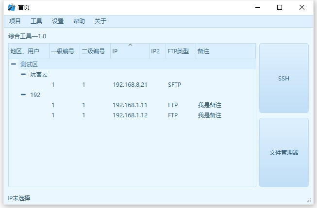

    
    
    
    
    
    

# 🚀 关于Kshell
Kshell是一款基于QT和Libcurl开的window平台的一个SSH，FTP工具。

他是我独自设计、开发、维护的项目。

其中关于SSH的开发是基于Qssh这个库开发，QT中没有自带SSH开发的lib，所以需要单独引用。 

文件管理，是基于Libcurl，之所以选择这个库的原因是因为它能同时支持FTP和SFTP两种协议，这样就可以极大的满足多说设备的需要。

另外整个KShell是围绕着“工程”的思想来开发，你可以在多处的设计上看到我的设计思路。

# ❓为社么要做KShell呢？
在我实际的项目中，我会频繁的用到ssh工具。我也用过xshell，finalshell，Mobaxterm，WinSCP，FileZilla等工具。
但是他们都不能很好的满足我要求，再加上我的业务中也需要进一步的提高效率，所以就萌生了做这个软件的想法。
KShell是从我的“业务工具”中剥离出来，只保留了SSH和FTP这两个功能，其他关于业务的部分已经删除。

# :muscle:KShell和市面上常见的软件有什么优势？
如果单从SSH和FTP这两个部分来说，他没有任何优势。无论是开发人员数量，还是从开发周期上，KSheel只能说是我的玩具。
但是他对于熟练使用qt并且能在日常的业务中需要SSH和FTP工具的开发者而言，kShell是一个很好的“基础程序”。
我已经帮你做好了一个可用的SSH和FTP工具，你可以在这个基础上开发出你想要的小功能。
比如在FTP功能中，你可以指定一个一个功能，比如你有一些特殊的数据文件，常规的软件只能帮你下载，你可以在这个基础上，实现文件下载后再自动解析，这样就不用使用多个软件来实现这个效果。
比如在FTP功能中，远程设备中的文件，要根据后缀名下载到不同的文件夹中，你就可以很简单的实现它。
等等等等。。。。

# :heart:技术亮点
## C++11，QT5.14

## 支持SSH
支持多线程，能同时连接多个设备。
支持命令列表，方便输入重复简单的命令
    。
## 支持SFTP和FTP协议
目前市面上大部分同时有SSH和FTP功能软件，除了Mobaxterm之外，我是另外一个能同时支持FTP和SFTP两种协议的。
并且，独有的是，我还能同时检测本地文件的浏览。
这样就能同时管理本地文件和远端文件。
    
## 支持云端升级以及远程文件控制
通过xml文件的修改，可以在不更改软件的情况下，实现对软件文件的远端控制，实现增删改查。
    
## 外观
支持3套皮肤，可以提供一个更好的外观选择。
    
# :camera_flash: 截图

## 首页
 

## 新建工程
 

## SSH客户端
 

## ftp客户端
 

## SHH和FTP融合
 

# :hammer:	安装

在relase中下载安装包即可。

# :blue_book:		使用方法/示例
好的产品，是不需要复杂的使用说明书，这也是我在设计之初就坚持的设计思路。
所以KShell在设计上我参考了常用的工具使用逻辑，所以很方便上手。
但是如果你想全面的了解它的功能，可参考我在b站的视频

