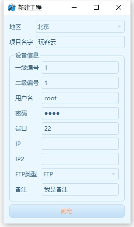

    
    
    
    
    
    

  

# 视频介绍 

[视频](https://www.bilibili.com/video/BV1ai421v76n/)  

# 🚀 关于Kshell
Kshell是一款基于QT和Libcurl开的window平台的一个SSH，FTP工具。

他是我独自设计、开发、维护的项目。 

# ❓为什么要做KShell呢？
1. 开源项目中,Qt+Qssh做出来且稍微成熟点的开源项目几乎没有,基本上都是demo状态.能够参考的开源项目几乎没有!我什么不能把这一块补上呢?

2. 甚至,连编译Qssh库都变得苦难重重.(但你现在不用担心了,我已经写了一篇文章,你可以参考下)

3. 我用到的工具都比较通用,没有对我的工作领域的痛点做了专门的改进.我为什么不自己做一个呢?

4. 做完之后.我想:既然每个人的工作痛点不一样,我为什么不能做一个基础版本的程序,让每个开发者能够根据自己的项目需求在这上面直接改,缩短开发时间.

***所以,我萌生了这个项目的想法!***  

# :heart:技术亮点

1. 支持SSH连接
	1. 支持多线程,可以连接多个终端
	2. 支持命令列表,方便输入命令
2. 文件传输
	1. 支持FTP和SFTP
	2. 支持文件保存后自动上传
	3. 可自定义选择编辑器
	4. 支持文件编辑,删除,更改.
	5. 支持文件管理器中文件图标和本地匹配
	6. 支持文件下载进度
3. 支持本地文件浏览 
	1. 支持上传文件
	2. 同样做了文件图标适配
	3. 可一键下载工程目录
4. 工程管理
	1. 每个ssh客户端有自己文件目录,到时候各个项目的文件就不会混在一块,提高文件管理效率.
	2. 可以在本地文件浏览窗口,一键直达该工程目录.
5. 自动升级
	1. 支持云端自动升级,每天自动检查更新一次(也可手动检查).
	2. 远端可以实现对本地文件的控制,通过xml文件可以在远端控制本地的文件增删改查.不单单是一个自动升级.
6. 外观
	1. 自持三套皮肤,可自由更换.
	2. 所有窗口做了布局,窗口自由拉伸.
7. 用户管理
	1. 工程化思维的方式去建立工程
	2. 以地区`地区`和`项目`为基础做的分类.
	3. 给了两个ip配置,方便内网和外网ip配置.
    
# :camera_flash: 截图

## 演示
 

## 首页
 

## 新建工程
 

## SSH客户端
 

## ftp客户端
 

## SHH和FTP融合
 

# :hammer:	安装

在relase中下载后,解压即可。

# :blue_book:		使用方法/示例
好的产品，是不需要复杂的使用说明书，这也是我在设计之初就坚持的设计思路。

所以KShell在设计上我参考了常用的工具使用逻辑，所以很方便上手。

但是如果你想全面的了解它的功能，可参考我在b站的视频

# 引用的第三方库
QSHH
一般来说,这个lib会在遍历lib上遇到一些问题.可以参考我这篇文章,帮助你更快的编译lib.
https://blog.csdn.net/weixin_46537765/article/details/126265086?spm=1001.2014.3001.5501

Libcurl
选用这个库的目的是为了同时支持FTP和SFTP,QSSH只能支持SFTP.
要注意,编译Libcurl的时候,一定要加上openssl才能同时支持,要不然只能支持FTP.
